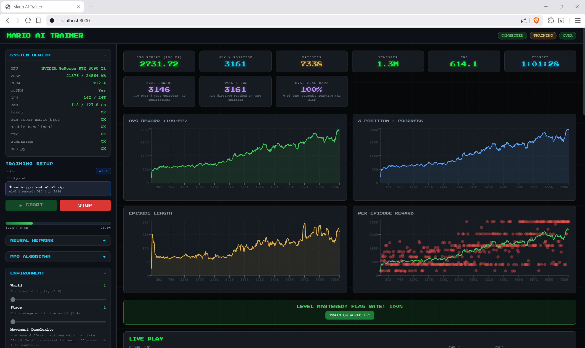

# MARIO AI TRAINER

**Train a neural network to beat Super Mario Bros — watch it learn in real time.**


<p align="center">
  
  <br>
  <em>Real-time training dashboard with live play, metrics, and replay browser</em>
</p>

---

## Highlights

- **One-click setup** — GPU auto-detected, CUDA configured automatically
- **Real-time dashboard** — live reward curves, episode stats, and system health
- **Watch the AI play** — ~15 FPS WebSocket stream directly in the browser
- **Replay system** — scrub through past episodes with speed controls and MP4 export
- **32-level progression** — train across all worlds with transfer learning between levels
- **Research-tuned hyperparameters** — gamma=0.9, reward clipping, linear LR annealing
- **Resume anytime** — checkpoint system with per-level best model tracking
- **Zero-build frontend** — no npm, no webpack, just open the browser

## Quick Start

```bash
# 1. Clone
git clone https://github.com/mgelsinger/mario-ai-trainer.git
cd mario-ai-trainer

# 2. Setup (auto-detects GPU, installs everything)
setup.bat          # Windows
# or
.\setup.ps1        # PowerShell

# 3. Run
venv\Scripts\activate
python server.py

# 4. Open http://localhost:8000
```

From clone to training in under 5 minutes.

> **Prerequisite:** [Visual C++ Build Tools](https://visualstudio.microsoft.com/visual-cpp-build-tools/) with the "Desktop development with C++" workload (required for nes-py compilation).

## Dashboard Overview

<!-- Replace with an annotated screenshot of your dashboard -->
<p align="center">
  
</p>

| Panel | What it shows |
|-------|--------------|
| **System Health** | GPU model, VRAM usage, CUDA version, CPU/RAM stats |
| **Hyperparameters** | All training params tunable from the UI — learning rate, gamma, entropy, batch size |
| **Training Charts** | Live reward and episode length curves via Recharts |
| **Live Play** | Stream the agent playing in real time (~15 FPS over WebSocket) |
| **Replay Browser** | Scrub through recorded episodes, adjust playback speed, export MP4 |
| **Level Tracker** | Progress across all 32 levels with "next level" prompt at 80% flag rate |

## How It Works

```
┌─────────────────────────────────────────────────────────┐
│                     Browser (React 18)                  │
│   Charts · Live Play · Replays · Controls · Metrics     │
└──────────────┬──────────────────────┬───────────────────┘
               │ REST API             │ WebSocket
               ▼                      ▼
┌─────────────────────────────────────────────────────────┐
│                  FastAPI Server (server.py)              │
│          Training control · Play sessions · Levels      │
└──────────────┬──────────────────────┬───────────────────┘
               │                      │
               ▼                      ▼
┌──────────────────────┐  ┌───────────────────────────────┐
│   PPO Trainer        │  │   Live Play Thread            │
│   (trainer.py)       │  │   Independent env + model     │
│                      │  │   Streams frames via WS       │
│   8× SubprocVecEnv   │  └───────────────────────────────┘
│   + eval env         │
└──────────┬───────────┘
           │
           ▼
┌─────────────────────────────────────────────────────────┐
│              Environment Wrappers (env_wrappers.py)     │
│  GymToGymnasiumAdapter · FrameSkip (max-pool last 2)   │
│  GrayscaleResize · NormalizeObs · FrameStack (4)        │
│  RewardShaping · EpisodeRecorder · JoypadSpace          │
└──────────────┬──────────────────────────────────────────┘
               │
               ▼
┌─────────────────────────────────────────────────────────┐
│           Super Mario Bros (NES via nes-py)             │
└─────────────────────────────────────────────────────────┘
```

**PPO** (Proximal Policy Optimization) trains across **8 parallel environments** using `SubprocVecEnv`. Each environment passes through 7 custom wrappers — bridging the old gym API to gymnasium, applying frame skip with max-pooling (to avoid NES sprite flicker), grayscale + resize, reward shaping with death penalties, and 4-frame stacking for temporal context.

A separate evaluation environment runs in the main process with an episode recorder. Every 50K steps, 3 deterministic eval episodes measure actual performance without exploration noise.

The frontend is vanilla React 18 loaded via CDN — no build step, no transpilation, no node_modules. Just open `localhost:8000`.

## Training Tips

**What to expect:**

| Timesteps | Behavior |
|-----------|----------|
| ~100K | Learns to move right, mostly dies early |
| ~500K | Starts jumping over gaps and enemies |
| ~1M | Consistent forward progress, occasionally completes the level |
| ~5M+ | Reliable level completion |

**Key insights:**

- **gamma = 0.9** (not 0.99) — Mario needs reactive, short-horizon decision-making. High gamma overvalues distant, unreachable rewards.
- **Reward clipping at +/-15** — matches the built-in reward scale, prevents gradient explosion from large death penalties.
- **Transfer learning** — train on World 1-1 until 80%+ flag rate, then load that checkpoint as the starting point for World 1-2. The agent retains movement skills and learns new level layouts faster.
- **8 parallel environments** — more envs = more diverse experience per update. Fewer than 4 significantly slows convergence.

## Tech Stack

| Component | Technology |
|-----------|-----------|
| RL Framework | Stable-Baselines3 (PPO) |
| Deep Learning | PyTorch 2.0+ |
| Game Environment | gym-super-mario-bros + nes-py |
| Env Standard | Gymnasium |
| Backend | FastAPI + Uvicorn |
| Real-time Comms | WebSocket |
| Frontend | React 18 + Recharts (CDN, zero build) |
| Image Processing | OpenCV, Pillow |
| System Monitoring | psutil, nvidia-smi |

## Project Structure

```
mario-ai-trainer/
├── server.py           # FastAPI server — REST + WebSocket endpoints
├── trainer.py          # PPO training pipeline, live play, checkpoints
├── env_wrappers.py     # 7 custom environment wrappers
├── static/
│   └── index.html      # Real-time dashboard (React 18, no build step)
├── setup.bat           # One-click Windows setup (auto-detects GPU)
├── setup.ps1           # PowerShell alternative
├── requirements.txt    # Pinned dependencies (NumPy < 2.0)
└── checkpoints/        # Saved models (auto-created)
```

## Troubleshooting

| Problem | Solution |
|---------|----------|
| `nes-py` fails to install | Install [Visual C++ Build Tools](https://visualstudio.microsoft.com/visual-cpp-build-tools/) with the "Desktop development with C++" workload |
| NumPy errors / uint8 overflow | Ensure `numpy < 2.0` is installed — NumPy 2.x breaks nes-py |
| PyTorch doesn't detect GPU | The setup script uses the CUDA 12.4 index (`cu124`). Verify: `python -c "import torch; print(torch.cuda.is_available())"` |
| Blank page in browser | Make sure you're accessing `http://localhost:8000`, not a `file://` URL |

## License

[MIT](LICENSE)
